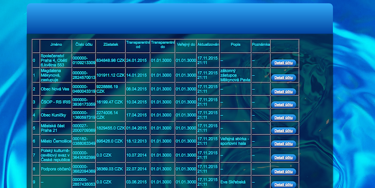
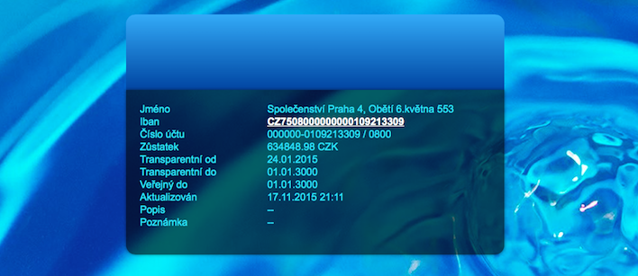

TransAcc is an Spring MVC app for test purposes written in Java.

## Features

- [x] Download transparent account list
- [x] View transparent account detail
- [x] [Connected to Ceska sporitelna a.s. API Portal] (https://developers.csas.cz/html/devs/transparent-accounts.html)

## Requirements

- Spring / Java 8 / Jetty / Maven 


## Migration Guides

- 
- 

## Communication

- via wifi or data network 

## Installation

### Current screens







#### Embedded Framework

- Spring MVC


### Making a Request

CS a.s. API portal (.GET, "https://developers.csas.cz/html/devs/transparent-accounts.html")
```

### Response Handling


## FAQ

### What's the origin of purpose?

Test jobs positions candidate 

---

## Credits

TransAcc is owned and maintained by Yogaboy 

### Security Disclosure

If you believe you have identified a security vulnerability with TransAcc, you should report it as soon as possible via email to CS a.s. Please do not post it to a public issue tracker.

## License


